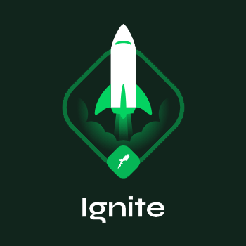

  

<h1 align="center">Ignite course activities and challenges</h1>
<h4 align="center"><a href="https://www.rocketseat.com.br/" target="_blank">Rocketseat</a></h4>

## ReactJS

1. ReactJS Fundamentals

> In this module we will create the base structure of a React application using tools such as Webpack, Babel, Webpack Dev server, SASS, Source Maps, Fast Refresh and we will discover important React concepts such as components, properties, states, and hooks. In addition, we will set up TypeScript in our project to add static typing to the application.

* Result: [Github Explorer](https://ignite-github-explorer.vercel.app/)

### Challenges

1. Apply the ReactJS Fundamentals

* [Github repository](https://github.com/rmmarquini/ignite-react-fundamentals)

> In this challenge, we will create a TODO list application as specified on this [link](https://www.notion.so/Desafio-01-Conceitos-do-React-51e4099a6e2f4d4bae94f9fe75bb769d).

* Result: [TODO List App](https://ignite-react-fundamentals.vercel.app/)

2. Application Componentization

* [Github repository](https://github.com/rmmarquini/ignite-app-componentization)

> In this challenge, we will use the [Lifting State Up](https://reactjs.org/docs/lifting-state-up.html) concept from ReactJS to get the application componentization applied. Follow this [link](https://www.notion.so/Desafio-02-Componentizando-a-aplica-o-b9f0f025c95b437699d0c3115f55b0f1) to read the challenge instructions.

